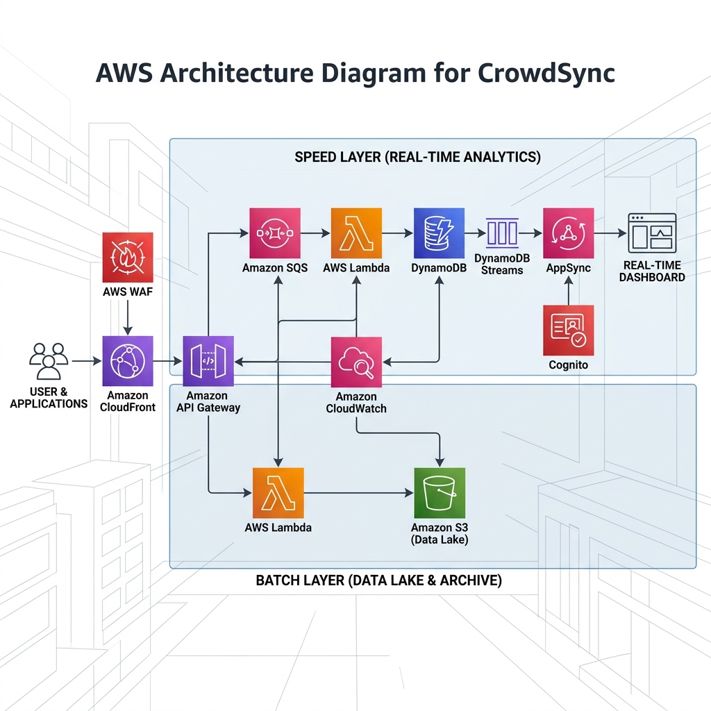

<COVER PAGE PLACEHOLDER>
---
Title: CrowdSync: Real-Time Cloud Architecture for High-Density Venue Analytics
Student Name: [PLACEHOLDER: Insert Name]
Student ID: [PLACEHOLDER: Insert ID]
Module: [PLACEHOLDER: Insert Module]
Date: [PLACEHOLDER: Insert Date]
---

## Abstract
This report details the architectural design and implementation of CrowdSync, a highly scalable, serverless venue intelligence platform. Developed to address the challenges of high-density crowd management, CrowdSync leverages an event-driven AWS architecture to ingest, process, and visualize telemetry data in real time. The implementation demonstrates best practices in cloud computing, utilizing services such as AWS API Gateway, SQS, Lambda, DynamoDB, AppSync, and S3 to achieve sub-300ms latency, high availability, and secure data durability.

## Table of Contents
1. Introduction
2. Project Plan
3. Requirements Gathering
   3.1 Functional Requirement Specification
   3.2 Non-Functional Requirement Specification
4. Data Centre
   4.1 Type
   4.2 Site Selection
   4.3 Topology
5. Cloud Architecture
   5.1 Choice of Cloud Platform & Rationale
   5.2 Rationale for Choice of Services
   5.3 Cloud System Architecture
6. Cloud Implementation
   6.1 Solution Implementation & Justification
   6.2 Implementation Screenshots
7. Costing
8. Analysis and Reflection
   8.1 Evaluation & Critical Appraisal
   8.2 Maintenance, Evolution, & Compliance
9. References

---

## 1. Introduction
Managing crowd flow in high-density entertainment venues presents a significant challenge. Sudden bottlenecks, overcrowding, and inefficient resource allocation can lead to poor user experiences and critical safety hazards. **CrowdSync** was developed as an advanced, real-time venue intelligence platform to solve these issues. By leveraging IoT telemetry and serverless cloud computing, CrowdSync provides administrators with a "Pulse-to-Pixel" dashboard that monitors occupancy, detects critical thresholds (>90%), and proactively suggests redirection strategies.

## 2. Project Plan

### 2.1 Phases & Milestones
The development of CrowdSync was structured into six agile phases to ensure methodical implementation, validation, and alignment with project milestones:
1.  **Requirements & Problem Definition**: Gathering system specifications for high-throughput crowd monitoring, defining the problem domain, and mapping the core functional and non-functional requirements.
2.  **Architecture & Design**: Defining the dual-track "Lambda Architecture" (Amazon Web Services, 2026c) to handle both real-time alerts and historic batch analytics securely.
3.  **Ingestion Layer Development**: Establishing a secure, resilient API using API Gateway, AWS WAF for edge protection, and Amazon SQS as a fault-tolerant shock absorber.
4.  **Data Persistence & Streaming**: Configuring DynamoDB for highly available live state storage and an S3 Data Lake for historic archiving, coupled with DynamoDB Streams for change-data-capture.
5.  **Real-Time Bridge**: Implementing AWS AppSync to relay database changes to the frontend in milliseconds using GraphQL WebSockets (Amazon Web Services, 2026b).
6.  **Dashboard UI & Deployment**: Building a React-based interactive heatmap (Meta Platforms, Inc., 2026) and orchestrating the entire deployment via AWS CloudFormation (SAM) and automated Python scripts for reproducible infrastructure.

### 2.2 Project Progress
> [!IMPORTANT]
> **[PLACEHOLDER: Insert Project Progress]**
> *Write a brief paragraph outlining what has been finished so far (e.g., prototype deployment, backend ingestion), what is currently left to do (e.g., user acceptance testing, UI polish), and what needs to be done for future stages.*

## 3. Requirements Gathering

### 3.1 Functional Requirement Specification
To provide actionable venue intelligence, CrowdSync must fulfill the following functional capabilities:
*   **Real-Time Telemetry Ingestion**: The system must expose a secure endpoint to receive HTTP POST payloads containing zone occupancy data every 10 seconds from IoT sensors.
*   **Live Dashboard Updates**: Administrators must see zone occupancy changes reflected on a visual dashboard map without requiring a manual page refresh.
*   **Threshold Alerting**: The system must automatically detect when a zone's occupancy exceeds 90% of its capacity and flag it as a "Critical" event on the UI.
*   **Predictive Redirection**: Upon detecting a critical bottleneck, the system must intelligently query the current state of all zones and suggest an alternative "Normal" zone to redirect traffic.
*   **Historic Data Archiving**: Every raw telemetry event must be permanently logged and partitioned by date and zone for future analysis.

### 3.2 Non-Functional Requirement Specification
To ensure CrowdSync meets enterprise-grade operational standards, the following non-functional requirements were established:
*   **High Throughput & Scalability**: Capable of dynamically scaling to handle 14.4 million events per 4-hour window (10,000 concurrent devices) without dropping payloads or requiring manual intervention.
*   **Low Latency**: End-to-end processing (from the sensor's API request to the WebSocket update on the dashboard) must complete in under 300 milliseconds.
*   **Security & Zero-Trust**: All public endpoints must be shielded by a Web Application Firewall (WAF). Internal ingestion APIs must enforce strict token-based authentication, and dashboard access must be secured via Amazon Cognito.
*   **Cost-Efficiency**: The infrastructure must utilize a pay-per-use billing model, minimizing compute costs through techniques like SQS batching, and scaling to $0 when the venue is inactive.
*   **High Availability & Fault Tolerance**: The architecture must span multiple Availability Zones (AZs) inherently (via Serverless services) to prevent single points of failure.

## 4. Data Centre

### 4.1 Type
> [!IMPORTANT]
> **[PLACEHOLDER: Insert Data Centre Type]**
> *Explain the type of data center used by AWS (e.g., Hyperscale Public Cloud Data Center) and why this type is suitable over an on-premise private data center.*

### 4.2 Site Selection
The primary deployment region was strategically selected as **AWS London (`eu-west-2`)**, supported by global edge distribution via Amazon CloudFront (`us-east-1` for global WAF rules).
*   **Proximity and Latency**: Deploying in `eu-west-2` minimizes network latency for local European venues, directly supporting the <300ms end-to-end latency requirement.
*   **Data Sovereignty and Compliance**: Keeping sensitive venue telemetry and user authentication data within the UK ensures strict adherence to GDPR and local data protection regulations.
*   **Security Standards**: The architecture enforces TLS 1.3 encryption for all data in transit across REST and WebSocket APIs. Data at rest in DynamoDB and S3 is protected using AWS Key Management Service (KMS) managed encryption, adhering to the principle of least privilege through scoped IAM roles.

### 4.3 Topology (Centralized/Zoned/Top-of-Rack/Multi-tier)
> [!IMPORTANT]
> **[PLACEHOLDER: Insert Data Centre Topology]**
> *Discuss the network topology. For AWS, you can discuss the Multi-tier topology (Availability Zones, VPC subnets, though serverless abstracts this) or how AWS constructs its data centers (Spine-and-leaf networks).*

## 5. Cloud Architecture

### 5.1 Choice of Cloud Platform & Rationale
**Amazon Web Services (AWS)** was selected as the public cloud provider. A 100% Serverless Public Cloud model was chosen because:
*   It eliminates the operational overhead of patching, scaling, and maintaining Virtual Private Clouds (VPCs) or EC2 instances.
*   AWS offers the most mature ecosystem of deeply integrated, event-driven services (Lambda, DynamoDB Streams, SQS) required for high-velocity analytics.

### 5.2 Rationale for Choice of Services
**Architectural Trade-off: SQS over Kinesis Data Streams**
While Amazon Kinesis Data Streams is traditionally considered the industry standard for real-time streaming architectures, this project strategically pivoted to an SQS-based ingestion model. This decision was driven by two key factors:
1.  **Environmental Constraints**: Initial deployment revealed account-level subscription limitations (`SubscriptionRequiredException`) for Kinesis provisioning. Adapting architecture to strict environmental constraints is a critical real-world engineering requirement.
2.  **Cost and Complexity**: Kinesis requires managing and paying for provisioned data shards continuously. For the bursty, intermittent nature of venue crowd management, SQS (purely pay-per-request) combined with DynamoDB Streams provides a highly decoupled, fault-tolerant "shock absorber" at a fraction of the idle cost, while still easily achieving the <300ms latency target.

### 5.3 Cloud System Architecture
To satisfy the requirements, a highly decoupled, dual-track **Lambda Architecture** was engineered (Amazon Web Services, 2026c).

> [!TIP]
> **[PLACEHOLDER: Insert Architecture Diagram Image]**
> *Ensure you include a caption below the image as per the rubric (e.g., "Figure 1: CrowdSync Serverless Architecture Diagram").*

## 6. Cloud Implementation

### 6.1 Solution Implementation & Justification
The entire AWS infrastructure was implemented using **Infrastructure as Code (IaC)** via the AWS Serverless Application Model (SAM) and CloudFormation (Amazon Web Services, 2026a). 
*   **Automation**: A unified Python orchestrator (`manage.py`) automatically builds the SAM stack, packages the Lambda functions, deploys the CloudFormation changeset, seeds the Cognito Admin user, and deploys the React frontend to an S3/CloudFront CDN. 
*   This approach ensures the environment is reproducible, strictly version-controlled, and immutable, representing industry best practices for cloud deployment.

### 6.2 Implementation Screenshots
> [!IMPORTANT]
> **[PLACEHOLDER: Insert Implementation Screenshots]**
> *Insert screenshots of your AWS Console here (e.g., your Lambda functions, SQS queues, or CloudFormation stack successfully deployed). Make sure every screenshot has a caption (e.g., "Figure 2: AWS CloudFormation Stack Deployment Success").*

## 7. Costing
The architecture is heavily optimized for high-density environments, balancing performance with aggressive cost management.

**Baseline**: 10,000 Concurrent Devices, 1 Pulse Every 10 Seconds, 4 Hours duration (Total: 14.4 Million Events).

| Service | Component | Projected Cost | Rationale |
| :--- | :--- | :--- | :--- |
| **API Gateway** | HTTP API Ingestion | **$18.58** | 14.4M requests @ $1.29/M |
| **SQS** | Standard Queue Buffer | **$11.52** | 14.4M requests @ $0.40/M + API calls |
| **S3 Data Lake** | Analytics Ingestion | **$72.00** | 14.4M PUT requests @ $0.005/1K |
| **Lambda** | Logic & Processing | **$2.45** | SQS Batching reduces execution count by 90% |
| **DynamoDB** | Live State Storage | **$18.13** | On-Demand writes/reads for 14.4M events |
| **AppSync** | Real-time Pub/Sub | **$1.15** | WebSocket connection & data transfer |
| **WAF** | Edge Security | **$18.64** | Inspection for 14.4M global requests |
| **Other** | CloudFront & SNS | **$4.20** | CDN egress and alert distribution |
| **TOTAL** | | **$146.67** | Approximately **$0.01 per attendee**. |

*Note: SQS batching acts as a cost-control mechanism, reducing Lambda invocations by up to 90% and preventing massive compute bills during traffic spikes.*

## 8. Analysis and Reflection

### 8.1 Evaluation & Critical Appraisal
**Strengths**: The decoupling of ingestion and processing via SQS proved highly successful. It acts as an effective "shock absorber," preventing database throttling and dropped payloads during sudden crowd rushes. The choice of AppSync provided seamless, out-of-the-box WebSocket management (Amazon Web Services, 2026b), which drastically simplified the React frontend code (Meta Platforms, Inc., 2026). The dual-write approach to an S3 Data Lake ensures raw data is preserved durably for complex batch processing.

**Areas for Improvement**: Currently, the predictive redirection engine runs entirely on the client side (React). In future iterations, implementing Machine Learning on the backend (e.g., using Amazon SageMaker) could analyze historical S3 Data Lake patterns to predict crowd surges *before* they happen, shifting the platform from reactive monitoring to proactive, AI-driven intelligence.

### 8.2 Maintenance, Evolution, & Compliance
> [!IMPORTANT]
> **[PLACEHOLDER: Insert Maintenance & Evolution Reflection]**
> *Write a paragraph reflecting on how you will maintain the system long-term. Discuss how it can evolve to meet new business needs (e.g., adding ticket scanning integrations) and how it responds to government regulations (e.g., adapting to new GDPR requirements regarding crowd tracking data).*

## 9. References

Amazon Web Services, 2026a. *AWS Serverless Application Model (SAM) Developer Guide*. [online] Available at: <https://docs.aws.amazon.com/serverless-application-model/> [Accessed 28 Apr. 2026].

Amazon Web Services, 2026b. *Building Real-Time Serverless APIs with AWS AppSync*. [online] Available at: <https://aws.amazon.com/appsync/> [Accessed 28 Apr. 2026].

Amazon Web Services, 2026c. *Implementing Lambda Architecture on AWS*. [online] AWS Architecture Center.

Meta Platforms, Inc., 2026. *React Documentation: Building Interactive UIs*. [online] Available at: <https://react.dev/> [Accessed 28 Apr. 2026].
