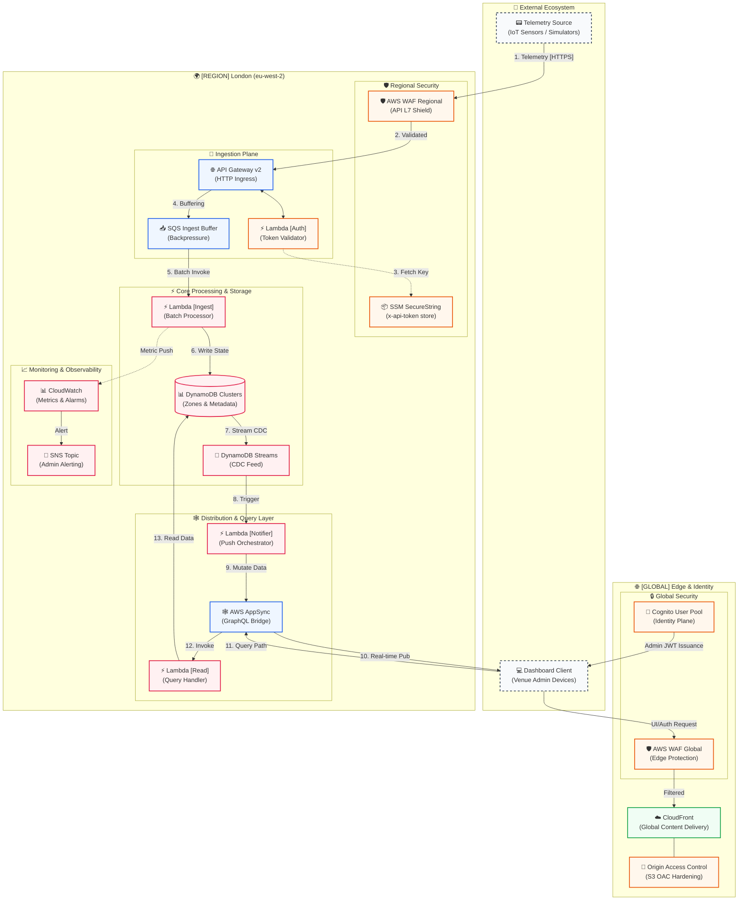

# ✥ CrowdSync — Advanced Venue Intelligence ✥

[](https://www.terraform.io/)
[](https://aws.amazon.com/)
[](https://graphql.org/)
[](https://reactjs.org/)

> **The Unified Command Center for Real-time Crowd Orchestration and Predictive Redirection.**

---

---

## 🌐 Cloud Infrastructure Topology

CrowdSync is built on a high-availability, secure-by-default serverless architecture. The diagram below visualizes the end-to-end telemetry flow, from edge ingestion to real-time dashboard distribution.



---

## 🛠️ Technology Stack Breakdown

| Layer | Service | Rationale |
| :--- | :--- | :--- |
| **Ingestion** | **API Gateway + Lambda** | Provides a lightweight, high-throughput REST entry point specifically for simulation devices and hardware sensors. |
| **Storage** | **DynamoDB** | NoSQL performance with **Change Data Capture (CDC)** capabilities via Streams for real-time propagation. |
| **Real-time Bus** | **AWS AppSync** | Unified data interface. Replaces multiple REST endpoints with a single GraphQL schema and native WebSocket support. |
| **Security** | **AWS Cognito** | Managed Identity Provider. Handles JWT issuance and secure authentication for administrative staff. |
| **Delivery** | **CloudFront + S3** | Global edge distribution of the dashboard assets with Origin Access Control (OAC) for hardened bucket security. |
| **IaC** | **Terraform** | 100% of the architecture is codified, ensuring reproducible environments across Dev, Staging, and Production. |

---

## 💰 Operational Economics

CrowdSync is engineered for high-density scalability with a predictable serverless cost model optimized for the **AWS London (eu-west-2)** region.

### 📊 High-Density Event Baseline
- **Scale**: 10,000 Concurrent Devices
- **Frequency**: 1 Pulse Every 10 Seconds
- **Duration**: 4 Hours
- **Total Load**: **14.4 Million Ingestion Events**

### 💸 Projected Cost Breakdown

| Service | Component | Projected Cost (Event) |
| :--- | :--- | :--- |
| **API Gateway** | HTTP API Ingestion | **$18.58** |
| **SQS** | Standard Queue Buffer | **$11.52** |
| **Lambda** | Logic Engines | **$1.79** |
| **DynamoDB** | On-Demand Storage | **$18.13** |
| **AppSync** | Real-time Updates | **$1.15** |
| **WAF** | Edge Security | **$18.64** |
| **Other** | CloudFront, Monitoring | **$4.20** |
| **TOTAL** | | **$74.01** |

> [!TIP]
> **Cost per 1,000 Attendees**: ~$7.40 per 4-hour window.
> **Optimization**: Automated SQS batching reduces Lambda invocation costs by 90%.

---

## 🧠 Predictive Redirection Logic

CrowdSync goes beyond monitoring. The dashboard features a **client-side intelligence engine** that proactively manages crowd flow:

1.  **Detection**: As soon as a "Critical" event (occupancy > 90%) arrives via the AppSync WebSocket...
2.  **Analysis**: The system triggers a scan of the global venue state stored in the React context.
3.  **Targeting**: It identifies the zone with the **Lowest Occupancy Percentage** that is currently in a "Normal" state.
4.  **Action**: The system generates a high-clarity **Redirection Strategy** (e.g., `Alternative: ZONE-F6`) displayed instantly on the mission control alerts.

---

## 🛡️ Security Architecture

### 🔐 Zero-Trust Foundation
*   **Scoped IAM**: Lambda functions operate under strict "Least Privilege" roles, with access only to specific Table/Stream resources.
*   **OAC Hardening**: The S3 Frontend bucket is 100% private; all traffic is forced through CloudFront for edge security and HTTPS termination.
*   **Authorizers**:
    *   **Ingest**: Protected by a custom Lambda authorizer verifying an `x-api-token` against SSM SecureStrings.
    *   **Dashboard**: Authenticated via **Cognito User Pools**. All GraphQL queries/subscriptions require a valid JWT.

### 📜 Data Integrity
*   **Encryption at Rest**: DynamoDB and S3 utilize AWS-KMS managed encryption.
*   **In-Transit**: TLS 1.3 is enforced across all communication channels (REST, GraphQL, and WebSockets).

---

## 🚀 Deployment & Administration

The project is managed through a central **Operational Script** located in `scripts/manage.py`.

### ✥ One-Command Deploy
```bash
python3 scripts/manage.py up
```
This triggers a **Two-Phase Lifecycle**:
1.  **Infrastructure**: Provisioning of all AWS resources.
2.  **Injection**: Live AWS IDs (API URLs, UserPool IDs) are automatically injected into the React `aws-config.ts`.
3.  **Deployment**: The UI is compiled and synced to S3/CloudFront.

### ✥ Local Simulation
```bash
python3 scripts/simulate.py
```
Starts the telemetry heartbeats, pushing randomized (but logically consistent) crowd data into the ingestion pipeline.

---

## 🛠️ Troubleshooting & Technical Gotchas

### ✥ "Unexpected Attribute" Linting Errors
If you see errors in your IDE or CLI regarding "Unexpected attributes" (e.g., `metadata_arn`), this is a common synchronization event when new module variables are added.
*   **The Cause**: Terraform's internal module registry is out of sync with the new `variables.tf` definitions.
*   **The Fix**: Run `/opt/homebrew/bin/terraform init`. This re-scans the module definitions and maps the new variables correctly. It is safe to run even while infrastructure is deployed.

### ✥ Persistent Dashboard Cache
If the dashboard appears to show old UI text after a deployment:
*   **The Cause**: CloudFront edge caches or local browser caches.
*   **The Fix**: Use `python3 scripts/manage.py status` to get the latest distribution ID and manually trigger an invalidation, or perform a **Hard Refresh** (Cmd+Shift+R) in your browser.

---

## 📂 Project Structure

```text
.
├── 📂 dashboard/               # High-Fidelity React Frontend
│   ├── 📂 src/
│   │   ├── 📄 App.tsx          # Real-time Telemetry & Redirection Engine
│   │   └── 📄 aws-config.ts    # ⚡ Auto-managed Cloud Configuration
├── 📂 lambda_src/              # Ingest & Notifier Lambda logic
├── 📂 modules/                 # Modular Terraform (API, AppSync, Auth, S3)
├── 📂 scripts/                 # Operational Workflow Engine
├── 📄 main.tf                   # Root Root Orchestrator
└── 📄 README.md                 # System Architectural Manifesto
```

---
*✥ Engineered for Operational Excellence ✥*
