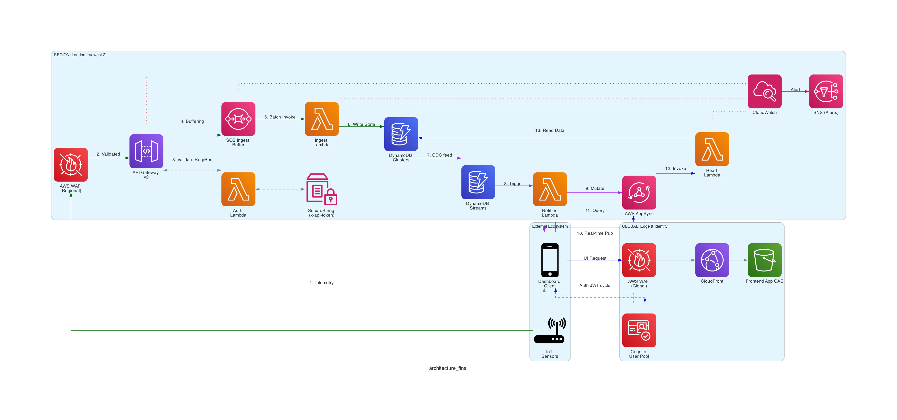

# ✥ CrowdSync — Advanced Venue Intelligence ✥

[](https://www.terraform.io/)
[](https://aws.amazon.com/)
[](https://graphql.org/)
[](https://reactjs.org/)

> **The Unified Command Center for Real-time Crowd Orchestration and Predictive Redirection.**

---

---

## 🌐 Cloud Infrastructure Topology

CrowdSync is built on a high-availability, secure-by-default serverless architecture. The diagram below visualizes the end-to-end telemetry flow, from edge ingestion to real-time dashboard distribution.



---

## 🏗️ Architectural Components Breakdown

To understand how CrowdSync achieves sub-350ms "Pulse-to-Pixel" latency securely, here is an explicit node-by-node trace of every AWS service mapped in the architecture:

### 1. Global Edge & Identity (The Front Door)

#### AWS WAF (Global)
*   **Role**: The first line of defense blocking malicious bots, SQL injections, and DDoS attempts.
*   **Receives From**: Dashboard Client (Browser) UI Requests.
*   **Sends To**: Amazon CloudFront.

#### Amazon CloudFront
*   **Role**: A globally distributed CDN that caches the React Dashboard UI close to venue administrators, ensuring fast load times worldwide.
*   **Receives From**: AWS WAF (Global).
*   **Sends To**: Amazon S3 (Frontend Bucket).

#### Amazon S3 (with OAC)
*   **Role**: Stores the compiled frontend React assets. Origin Access Control (OAC) guarantees this bucket is 100% private and impenetrable from the raw internet.
*   **Receives From**: Amazon CloudFront (exclusively via secure OAC signing).
*   **Sends To**: Dashboard Client (serves UI files).

#### Amazon Cognito (User Pool)
*   **Role**: Handles administrator authentication and identity management, providing secure JWTs (JSON Web Tokens).
*   **Receives From**: Dashboard Client (Login Request).
*   **Sends To**: Dashboard Client (Returns JWT Token).

### 2. Regional Security (The Ingestion Shield)

#### AWS WAF (Regional)
*   **Role**: A strict secondary firewall explicitly protecting our internal telemetry ingestion API from malicious payloads.
*   **Receives From**: IoT Sensors / Telemetry Sources.
*   **Sends To**: Amazon API Gateway v2.

#### AWS Systems Manager (SSM) Parameter Store
*   **Role**: Securely encrypts and stores the master `x-api-token`. Ensures no hardcoded secrets exist in our Lambdas.
*   **Receives From**: Auth Lambda (Lookup Query).
*   **Sends To**: Auth Lambda (Returns decrypted master token).

### 3. Ingestion Plane (The Shock Absorber)

#### Amazon API Gateway v2
*   **Role**: A highly scalable HTTP API endpoint that receives concurrent HTTPS telemetry pulses.
*   **Receives From**: AWS WAF (Regional).
*   **Sends To**: Auth Lambda (for validation) and then to Amazon SQS (for buffering).

#### Auth Lambda
*   **Role**: A custom Lambda authorizer that executes a strict Bi-Directional Request/Response loop to halt incoming API Gateway traffic and authorize the `x-api-token`.
*   **Receives From**: Amazon API Gateway.
*   **Sends To**: SSM Parameter Store (Lookup), and then returns Allow/Deny policy back to API Gateway.

#### Amazon SQS (Ingest Buffer)
*   **Role**: The "Backpressure" queue. It absorbs traffic spikes and automatically packs up to 10 payloads into a single execution batch, drastically lowering compute costs.
*   **Receives From**: Amazon API Gateway.
*   **Sends To**: Ingest Lambda (Batch Trigger).

### 4. Core Processing (The Brain)

#### Ingest Lambda
*   **Role**: Pulls large batched payloads off the SQS queue and natively bulk-writes them into the database simultaneously.
*   **Receives From**: Amazon SQS.
*   **Sends To**: Amazon DynamoDB ("Zones" Table).

#### Amazon DynamoDB (Clusters)
*   **Role**: Operates incredibly efficiently across two isolated tables (`PAY_PER_REQUEST` billing). The volatile "Zones" table stores live occupancy, while the "Metadata" table hosts static geofence rules.
*   **Receives From**: Ingest Lambda (Write), Read Lambda (Query).
*   **Sends To**: DynamoDB Streams (CDC Events).

#### DynamoDB Streams
*   **Role**: A Change Data Capture (CDC) engine exclusively monitoring the "Zones" table. It fires an event the exact millisecond an occupancy row changes.
*   **Receives From**: Amazon DynamoDB (Internal table updates).
*   **Sends To**: Notifier Lambda (Trigger).

### 5. Distribution Layer (The Real-Time Bridge)

#### Notifier Lambda
*   **Role**: Formats the database change event from the Stream and fires an orchestration mutation directly to the GraphQL API.
*   **Receives From**: DynamoDB Streams.
*   **Sends To**: AWS AppSync.

#### AWS AppSync (GraphQL)
*   **Role**: Our real-time pub/sub bridge. Maintains an active WebSocket connection pushing live zone updates instantly to connected administrators.
*   **Receives From**: Notifier Lambda (Mutations), Dashboard Client (Queries).
*   **Sends To**: Dashboard Client (Real-time Pub), Read Lambda (Query Invocation).

#### Read Lambda
*   **Role**: Handles historic or ad-hoc data queries requested via AppSync when the admin dashboard boots up or refreshes.
*   **Receives From**: AWS AppSync.
*   **Sends To**: Amazon DynamoDB (Read Query).

### 6. Monitoring & Observability (The Nervous System)

#### Amazon CloudWatch
*   **Role**: Constantly parses native metrics (API 5XXs, Lambda crashes, SQS Backlogs > 1000, DDB Throttling) and keeps a pulse on technical health.
*   **Receives From**: API Gateway, Lambdas, SQS, DynamoDB (Metric Pushes).
*   **Sends To**: Amazon SNS (Alert Trigger).

#### Amazon SNS (Alerts Topic)
*   **Role**: An escalation engine. If CloudWatch detects any stress or failure across the components above, it immediately pages or emails administrators.
*   **Receives From**: Amazon CloudWatch.
*   **Sends To**: Venue Administrators (Email/SMS).

---

## 💰 Operational Economics

CrowdSync is engineered for high-density scalability with a predictable serverless cost model optimized for the **AWS London (eu-west-2)** region.

### 📊 High-Density Event Baseline
- **Scale**: 10,000 Concurrent Devices
- **Frequency**: 1 Pulse Every 10 Seconds
- **Duration**: 4 Hours
- **Total Load**: **14.4 Million Ingestion Events**

### 💸 Projected Cost Breakdown

| Service | Component | Projected Cost (Event) |
| :--- | :--- | :--- |
| **API Gateway** | HTTP API Ingestion | **$18.58** |
| **SQS** | Standard Queue Buffer | **$11.52** |
| **Lambda** | Logic Engines | **$1.79** |
| **DynamoDB** | On-Demand Storage | **$18.13** |
| **AppSync** | Real-time Updates | **$1.15** |
| **WAF** | Edge Security | **$18.64** |
| **Other** | CloudFront, Monitoring | **$4.20** |
| **TOTAL** | | **$74.01** |

> [!TIP]
> **Cost per 1,000 Attendees**: ~$7.40 per 4-hour window.
> **Optimization**: Automated SQS batching reduces Lambda invocation costs by 90%.

---

## 🧠 Predictive Redirection Logic

CrowdSync goes beyond monitoring. The dashboard features a **client-side intelligence engine** that proactively manages crowd flow:

1.  **Detection**: As soon as a "Critical" event (occupancy > 90%) arrives via the AppSync WebSocket...
2.  **Analysis**: The system triggers a scan of the global venue state stored in the React context.
3.  **Targeting**: It identifies the zone with the **Lowest Occupancy Percentage** that is currently in a "Normal" state.
4.  **Action**: The system generates a high-clarity **Redirection Strategy** (e.g., `Alternative: ZONE-F6`) displayed instantly on the mission control alerts.

---

## 🛡️ Security Architecture

### 🔐 Zero-Trust Foundation
*   **Scoped IAM**: Lambda functions operate under strict "Least Privilege" roles, with access only to specific Table/Stream resources.
*   **OAC Hardening**: The S3 Frontend bucket is 100% private; all traffic is forced through CloudFront for edge security and HTTPS termination.
*   **Authorizers**:
    *   **Ingest**: Protected by a custom Lambda authorizer verifying an `x-api-token` against SSM SecureStrings.
    *   **Dashboard**: Authenticated via **Cognito User Pools**. All GraphQL queries/subscriptions require a valid JWT.

### 📜 Data Integrity
*   **Encryption at Rest**: DynamoDB and S3 utilize AWS-KMS managed encryption.
*   **In-Transit**: TLS 1.3 is enforced across all communication channels (REST, GraphQL, and WebSockets).

---

## 🚀 Deployment & Administration

The project is managed through a central **Operational Script** located in `scripts/manage.py`.

### ✥ One-Command Deploy
```bash
python3 scripts/manage.py up
```
This triggers a **Two-Phase Lifecycle**:
1.  **Infrastructure**: Provisioning of all AWS resources.
2.  **Injection**: Live AWS IDs (API URLs, UserPool IDs) are automatically injected into the React `aws-config.ts`.
3.  **Deployment**: The UI is compiled and synced to S3/CloudFront.

### ✥ Local Simulation
```bash
python3 scripts/simulate.py
```
Starts the telemetry heartbeats, pushing randomized (but logically consistent) crowd data into the ingestion pipeline.

---

## 🛠️ Troubleshooting & Technical Gotchas

### ✥ "Unexpected Attribute" Linting Errors
If you see errors in your IDE or CLI regarding "Unexpected attributes" (e.g., `metadata_arn`), this is a common synchronization event when new module variables are added.
*   **The Cause**: Terraform's internal module registry is out of sync with the new `variables.tf` definitions.
*   **The Fix**: Run `/opt/homebrew/bin/terraform init`. This re-scans the module definitions and maps the new variables correctly. It is safe to run even while infrastructure is deployed.

### ✥ Persistent Dashboard Cache
If the dashboard appears to show old UI text after a deployment:
*   **The Cause**: CloudFront edge caches or local browser caches.
*   **The Fix**: Use `python3 scripts/manage.py status` to get the latest distribution ID and manually trigger an invalidation, or perform a **Hard Refresh** (Cmd+Shift+R) in your browser.

---

## 📂 Project Structure

```text
.
├── 📂 dashboard/               # High-Fidelity React Frontend
│   ├── 📂 src/
│   │   ├── 📄 App.tsx          # Real-time Telemetry & Redirection Engine
│   │   └── 📄 aws-config.ts    # ⚡ Auto-managed Cloud Configuration
├── 📂 lambda_src/              # Ingest & Notifier Lambda logic
├── 📂 modules/                 # Modular Terraform (API, AppSync, Auth, S3)
├── 📂 scripts/                 # Operational Workflow Engine
├── 📄 main.tf                   # Root Root Orchestrator
└── 📄 README.md                 # System Architectural Manifesto
```

---
*✥ Engineered for Operational Excellence ✥*
